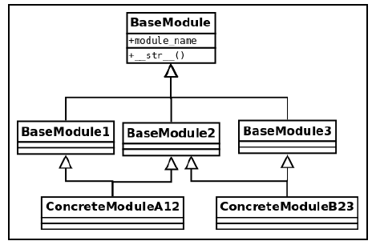

# Chapter 3_좋은 코드의 일반적인 특징
- 목표
    - 견고한 소프트웨어의 개념을 이해
    - 작업 중 잘못된 데이터를 다루는 방법
    - 새로운 요구 사항을 쉽게 받아들이고 확장할 수 잇는 유지보수가 쉬운 소프트웨어 설계
    - 재사용 가능한 소프트웨어 설계
    - 개발팀의 생산성을 높이는 효율적인 코드 작성
    
### 계약에 의한 디자인
- 소프트웨어는 사용자가 직접 호출하거나 
- 코드의 다른 부분에서 호출함
    - 레이어나 컴포넌트로 분리한 경우
- 컴포넌트는 기능을 숨겨 캡슐화하고 함수를 사용한 고객에게는 API를 노출해야 함
- 계약에 의한 디자인(Design by Contract)
    - 코드가 정상적으로 동작하는 것과 호출자가 반환 받기를 기대하는 것은 디자인의 하나가 되어야 함
    - 모든 당사자가 기대하는 것을 암묵적으로 코드에 배치하는 대신 
    - 위반시 예외를 제기하고 왜 계속할 수 없는지 명확하게 명시한 계약에 동의
    - 계약이란 반드시 지켜져야 할 규칙을 강제하는 것
    - 사전조건(precondition)
        - 코드가 실행되 전에 체크해야 하는 것들
    - 사후조건(postcondition)
        - 함수 반환값의 유효성 검사가 수행
    - 불변식(invariant)
        - 함수의 docstring에 불변식에 대해 문서화하는 것이 좋음
    - 부작용(side-effect)
        - 부작용을 docstring에 언급
    - 사전조건과 사후조건은 코드레벨에서 강제
#### 사전조건(precondition)
- 필요로 하는 값이 정확한지 확인하는 것
- 관용적인(tolerant) 접근법
    - 클라이언트가 함수 호출하기 전에 모든 유효성 검사
    - 함수가 어떤 값이라도 허용
- 까다로운(demanding) 접근법
    - 함수가 자체적으로 로직을 실행하기 전에 검사
- 사전조건 검증을 클라이언트와 함수내 양쪽에서 하지 말고 오직 한쪽에서 진행해야 함
#### 사후조건(postcondition)
- 반환된 후의 상태를 강제하는 계약의 일부
#### 파이썬스러운 계약
- 메서드, 함수 및 클래스에 RuntimeError, ValueError 예외를 발생시키는 제어 메커니즘 추가
#### 계약에 의한 디자인(DbC) - 결론
- 문제가 있는 부분을 효과적으로 식별
- 프로그램 구조를 명확히 하는 목적으로 사용
    - 함수나 메서드가 정상 동작하기 위해 기대하는 것이 무엇인지 정의
- 무엇을 검증할 것인지 신중히 검토
    - 함수에 전달되는 객체의 속성과 반환 값을 검사
    - 유지해야 하는 조건을 확인하는 작업 필요
 
### 방어적(defensive) 프로그래밍
- 계약에서 예외를 발생시키고 실해하게 되는 모든 조건을 기술하는 대신
- 객체, 함수 또는 메서드와 같은 코드의 모든 부분을 유효하지 않은 것으로부터 보호
- DbC와 서로 보완 관계
- 예상할 수 있는 시나리오의 오류를 처리하는 방법
    - 에러 핸들링 프로시저
- 발생하지 않아야 하는 오류를 처리하는 방법
    - 어썰션(assertion)
#### 에러 핸들링
- 예상되는 에러에 대해서 실행을 계속할지 중단할지 결정하는 것
- 에러 처리 방법
    - 값 대체(substitution)
        - 견고성과 정확성 간의 트레이드오프
        ``` 
        configuration = {"dbport": 5432}
        configuration .get("dbhost": "localhost")
        ```
        - 값 대체하는 것은 오류를 숨겨버릴 수 있으므로 주의해서 사용해야 함 
    - 에러 로깅
    - 예외 처리
        - 예외적인 상황을 명확하게 알려주고 원래의 비즈니스 로직에 따라 흐름을 유지하는 것
- 예외는 호출자에게 잘못을 알려주는 것
    - 캡슐화를 약화시키기 때문에 신중하게 사용
- 함수가 너무 많은 예외를 발생시키는 경우
    - 응집력이 약함
    - 많은 책임을 갖고 있음
    - 여러 개의 작은 것으로 나누는 것도 고려
- 예외 리펙토링
    - 올바른 수준의 추상화 단계에서 예외 처리
        - [리펙토링이 필요한 코드](errorhandling1.py)
        - [리펙토링 후 코드](errorhandling2.py)
    - Traceback 노출 금지
        - 오류가 너무 중요하다면 전파해도 됨
        - 정확성이 중요한 상황이라면 프로그램을 종료할 수 있음
        - traceback 정보, 메시지, 기타 수집 가능한 정보를 로그로 남기는 것이 중요
        - 세부사항은 절대 사용자에게 보여서는 안됨
        - 사용자에게 알리려면 일반적인 메시지를 사용
    - 비어있는 except 블록 지양
        - 가장 안 좋은 예
            ``` 
            try:
                process_data()
            except:
                pass
            ```
    - 원본 예외 포함
        - 오류 처리시 메시지를 변경할 경우에는 원본 메시지를 포함하는 것이 좋음
        - ```raise <e> from <original_exception>``` 구문 사용
            ``` 
            class InternalDataError(Exception):
                def process(data_dictionary, record_id):
                    try:
                        return data_dictionary[record_id]
                    exception KeyError as e:
                        raise InternalDataError("Record not present") from e
            ```    
#### 파이썬에서 어설션 사용하기
- 절대로 일어나지 않아야 하는 상황
- assert 문에 사용된 표현식은 불가능한 조건을 의미
- 비지니스 로직과 섞어나 소프트웨어의 제어 흐름 메커니즘으로 사용해서는 안됨
    ``` 
    try:
        assert condition.holds(), "조건에 맞지 않음."
    except AssertionError:
        alternative_procedure()
    ``` 
    - 어설션 문장이 함수인것도 나쁜 코드
    ``` 
    result= condition.holds()
    assert result > 0, "에러 {0}".format(result)
    ```
### 관심사의 분리
- 책임이 다르면 컴포넌트, 계층, 모듈로 분리되어야 함
- 각 부분은 기능의 관심사에 대해서만 책임을 지며 다른 부분에 대해서는 알 필요가 없음
- 파급(ripple) 효과를 최소화하여 유지보수성을 향상
- 유지보수성을 향상시키기 위해서는 적절한 캡슐화가 필요
#### 응집력(cohesion)과 결합력(coupling)
- 응집력
    - 객체가 작고 잘 정의된 목적을 가져야 하며 가능하면 작아야 함
    - 응집력이 높을수록 더 유용하고 재사용성이 높아지므로 더 좋은 디자인
- 결합력
    - 두 개 이상의 객체의 종속성
    - 낮은 재사용성
    - 파급 효과
    - 낮은 수준의 추상화
- 잘 정의된 소프트웨어는 높은 응집력과 낮은 결합력을 갖음
    - high cohesion and low coupling
### 개발 지침 약어
#### DRY(Do not Repeat Yourself)/OAOO(Once and Only Once)
- 코드 중복으로 인한 무제
    - 오류가 발생하기 쉬움
    - 비용이 비쌈
    - 신뢰성이 떨어짐
        ``` 
        def process_students_list(students):
            students_ranking = sorted(
                students, 
                key=lambda s: s.passed * 11 - s.failed * 5 - s.years * 2
            )
            
            for student in students_ranking:
                print(
                    "이름: {0}, 점수: {1}".format(
                        student.name,
                        (student.passed * 11 - student.failed * 5 - student.years * 2)
                    )
                )
        ```
    - 중복 리펙토링
        ``` 
        def score_for_student(student):
            return student.passed * 11 - student.failed * 5 - student.years * 2
            
        def process_students_list(students):
            students_ranking = sorted(students, key=score_for_student)
            
            for student in students_ranking:
                print(
                    "이름: {0}, 점수: {1}".format(
                        student.name, 
                        score_for_student(student)
                    )
                )
        ```  
    - 중복을 제거하는 방법
        - 함수 생성 기법
        - 완전히 새로운 객체
        - 컨텍스트 관리자 사용
        - 이터레이터나 제너레이터
        - 데코레이터
#### YAGNI(You Ain't Gonna Need it)
- 과잉 엔지니어링을 하지 않아야 함
- 유지 보수가 가능한 소프트웨어를 만드는 것은
    - 미래의 요구사항을 예측하는 것이 아님
    - 현재의 요구사항을 잘 해결하기 위한 소프트웨어를 작성
    - 나중에 수정하기 쉽도록 작성
#### KIS(Keep It Simple)
- 디자인이 단순할수록 유지 관리가 쉬움
- 문제에 맞는 가장 작은 데이터 구조를 사용
    - [리펙토링이 필요한 코드](ComplicatedNamespace1.py)
    - [리펙토링 후 코드](ComplicatedNamespace2.py)
#### EAFP(Easier to Ask Forgiveness than Permission)/LBYL(Look Before You Leap)
- EAFP
    - 실제 동작하지 않을 경우 대응
- LBYL
    - 동작하기 전에 미리 확인
    ``` 
    if os.path.exists(filename):
        with open(filename) as f:
    ```
- 파이썬은 EAFP방식으로 만들어졌음
    ``` 
    try:
        with open(filename) as f:
    except FileNotFoundError as e:
        logging.error(e)
    ```
### 컴포지션과 상속
- 메서드를 공짜로 얻을 수 있기 때문에 상속을 하는 것은 좋지 않음
- 코드를 재사용하는 올바른 방법
    - 여러 상황에서 동작 가능하고 쉽게 조립할 수 있는 응집력 높은 객체를 사용하는 것
#### 상속이 좋은 선택인 경우
- 파생 클래스를 만드는 것은 양날의 검이 될 수 있으므로 주의
    - 부모 클래스 메서드 전수 vs 너무 많은 기능 추가
- 상속받은 대부분의 메소드를 필요로 하지 않고 재정의하거나 대체해야 한다면 설계상 실수
    - 상위 클래스가 막연한 정의와 너무 많은 책임을 가졌을 경우
    - 하위 클래스가 상위 클래스의 적잘한 세분화가 아닌 경우
- 상속을 잘 사용한 예
    - http.server 패키지의 BaseHTTPRequestHandler 기본 클래스와 SimpleHTTPRequestHandler 하위 클래스
    - 인터페이스 정의
    - 예외
#### 상속 안티패턴
- [리펙토링이 필요한 코드](TransactionPolicy1.py)
    - 계층 구조가 잘못됨
        - TransactionPolicy 클래스가 사전 타입인지 도출하기 힘듬
    - 결합력에 대한 문제
        - 필요없는 메서드를 상속 받음
- [리펙토링 한 코드](TransactionPolicy2.py)
#### 파이썬의 다중상속
- 다중 상속은 양날의 검
    - 어댑터 패턴과 믹스인을 사용
- 메서드 결정 순서(MRO)

    - [멀티상속 코드](MultiInherit.py)
- 믹스인(mixin)
    - 코드를 재사용하기 위해 일반적인 행동을 캡슐화해놓은 기본 클래스
    - 믹스인 클래스 자체로는 유용하지 않음
    - 클래스에 정의된 메서드나 속성에 의존
    - 믹스인 클래스만 확장해서는 확실히 동작하지 않음
    - 다른 클래스와 함께 다중 상속하여 믹스인에 있는 메서드나 속성을 사용
    - [믹스인](mixin.py)    
### 함수와 메서드의 인자
#### 파이썬의 함수 인자 동작 방식
- 인자는 함수에 어떻게 복사되는가
    - 값에 의한 전달(passwd by a value)
    - mutable 객체를 전달시엔 부작용을 유발할 수 있으므로 주의해야 함
- 가변인자
    - 가변 인자를 사용하려면 패킹(packing)할 변수의 이름 앞에 별표를 사용
        ``` 
        def f(first, second, third):
            print(first, second, third)
            
        l = [1, 2, 3]
        f(*l)
        ```
    - 부분적인 언패킹도 가능
        ``` 
        def show(e, rest):
            print("요소: {0} - 나머지: {1}".format(e, rest))
        first, *rest = [1, 2, 3, 4, 5]
        show(first, rest)
        *rest, last = range(6)
        show(last, rest)
        first, *middle, last = range(6)
        first, last, *empty = (1, 2)
        ```
    - 변수 언패킹의 좋은 예는 반복임
        ``` 
        USERS = [(i, f"first_name_{i}", f"last_name_{i}") for i in range(1000)]
        
        class User:
            def __init__(self, user_id, first_name, last_name):
                self.user_id = user_id
                self.first_name = first_name
                self.last_name = last_name
        def bad_users_from_rows(dbrows) -> list:
            return [User(row[0], row[1], row[2]) for row in dbrows]
            
        def users_from_rows(dbrows) -> list:
            return [User(user_id, first_name, last_name) for (user_id, first_name, last_name) in dbrows]
        ```
        - max 함수도 좋은 사용 예
    - 이중 별표(**)를 키워드 인자에 사용할 수 있음
        - 사전에 이중 별표를 사용하여 함수에 전달하면 
            - 파라미터의 이름으로 키를 사용
            - 파라미터의 값으로 사전의 값을 사용
            ``` 
            function(**{"key": "value"})
            function(key="value")
            ```
        - 이중 별표로 시작하는 파라미터를 함수에 사용하면 키워드 제공 인자들이 사전으로 패킹
            ``` 
            def function(**kwargs):
                print(kwargs)
            function(key="value")
            ```
#### 함수 인자의 개수
- 너무 많은 파라미터가 필요한 경우 나쁜 코드일 수 있음
- 너무 많은 인자를 사용하는 함수나 메서드의 해결 방법
    - 소프트웨어 디자인의 원칙을 사용
        - 구체화(reification)
            - 모든 인자를 포함하는 새로운 객체를 만듬
            - 추상화를 빼먹었기 때문이라 판단 
    - 파이썬의 가변 인자나 키워드 인자 활용
        - 매우 동적이어서 유지보수하기 어렵기 때문에 주의해서 사용
    - 여러 작은 함수로 분리
- 함수 인자와 결합력
    - 함수 서명의 인수가 많을수록 호출자 함수와 밀접하게 결합될 가능성이 커짐
- 많은 인자를 취하는 작은 함수의 서명
    - 파라미터를 포함하는 공통 객체 활용
        ``` 
        track_request(request.headers, request.ip_addr, request.request_id)
        vs
        track_request(request)
        ```
        - 함수는 전달받은 객체를 변경할 경우 부작용이 발생할 수 있음
    - *args와 *kwargs 활용
        - 서명을 잃어버리며 가독성을 상실함
### 소프트웨어 디자인 우수 사례 결론
#### 소프트웨어의 독립성(orthogonality)
- 모듈, 클래스, 함수를 변경하면 수정한 컴포너트가 외부에 영향을 미치지 않아야 함
    - [orthogonality](orthogonality.py)
#### 코드 구조
- 대용량 파일을 작은 파일로 나눌땐 패키지를 활용
    - 모듈을 임포트할 때 구문을 분석하고 메모리에 로드할 객체가 줄어듬
    - 의존성이 줄었기 때문에 더 적은 모듈만 가져오면 됨
### 요약

