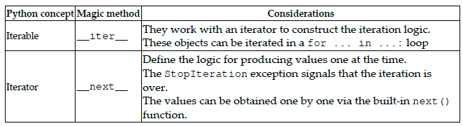

# Chapter 7_제너레이터 사용하기
* 목표
    - 프로그램의 성능을 향상시키는 제너레이터 만들기
    - 이터레이터가 파이썬에 어떻게 완전히 통합되었는지 확인
    - 이터레이션 문제를 이상적으로 해결하는 방법
    - 제니레이터가 어떻게 코루틴과 비동기 프로그래밍의 기반이 되는 역할을 하는지 확인
    - 코루틴을 지원하기 위한 yield from, await, async def와 같은 문법의 세부 기능 확인
### 기술적 요구사항
### 제너레이터 만들기
* 한 번에 하나씩 구성요소를 반환해주는 이터러블을 생성해주는 객체
    - 메모리를 절약하는 것이 목적
#### 제너레이터 개요
* yield 키워드를 사용하면 제너레이터 함수가 됨
* 모든 제너레이터 객체는 이터러블임
* [제너레이터 적용 전/후 예제-load_purchases](generators_1.py)
    ``` 
    def _load_purchases(filename):
        purchases = []
        with open(filename) as f:
            for line in f:
                *_, price_raw = line.partition(",")
                purchases.append(float(price_raw))
        return purchases
    ``` 
    ```
    def load_purchases(filename):
        with open(filename) as f:
            for line in f:
                *_, price_raw = line.partition(",")
                yield float(price_raw)
    ```
#### 제너레이터 표현식
* 제너레이터를 사용하면 메모리 절약 가능
* 이터러블이나 컨테이너의 대안이 될 수 있음
* 컴프리헨션(comprehension)에 의해 정의될 수 있음
    - 컴프리헨션이란 이터러블 객체를 쉽게 생성하기 위한 기법
    - (x**2 for x in range(10))
###이상적인 반복
#### 관용적인 반복 코드
* 시퀀스
    - [시퀀스1](number_sequence.py)
        - 이터러블 형태의 파라미터로 사용할 수 없음
    - [시퀀스2](sequence_of_numbers.py)
        - __iter__()와 __next__()를 구현하여 이터러블 객체로 만듬
        - next() 내장 함수 사용 가능
##### next() 함수
* 이터러블을 다음 요소로 이동시키고 기존의 값을 반환
    ``` 
    next = iter("hello")
    next(word)
    ...
    next(word, "default value") # StopIteration 발생시 디폴트값 리턴
    ```
##### 제너레이터 사용하기
* yield 키워드가 해당 함수를 제너레이터로 만들어 줌
    ``` 
    def sequence(start=0):
        while True:
            yield start
            start += 1
    seq = sequence(10)
    next(seq)
    list(zip(sequence(), "abcdef"))
    ```
##### itertools
* 이터러블은 파이썬과 잘 어울림
* itertools 모듈을 사용하면 이터레이션 기능을 활용할 수 있음
    - 위 sequence 예제는 itertools.count()와 유사함
* [구매 통계](generators_1.py)예제 에서 구매 이력에 조건 추가
    ```
    def process(self):
        for purchase in self.purchases:
            if purchase > 1000.0:
                ...
    ``` 
    - 기준 수치가 변경된다면?
    - 파라미터가 둘 이상 필요하다면?
    - 조건이 바뀐다면?
    - 람다 함수를 사용해야 하는가?
* 고유 책임은 구매 이력에 대해 잘 정의된 지표 값을 계산하고 출력하는 것
* 클라이언트의 요구로부터 독립되어야 함
* 융통성이 있어야 하고 외부 요인에 결합력이 높아서는 안됨
    ```
    from itertools import islice
    purchases = islice(filter(lambda p: p > 1000.0, purchases), 10)
    stats = PurchasesStats(purchases).process()
    ```
    - islice는 제너레이터 이므로 메모리 손해가 없음
##### 이터레이터를 사용한 코드 간소화
* itertools.tee
    - 이터러블을 여러개의 새로운 이터러블로 분할
    - [구매 통계 최종판](generators_2.py)
* 중첩 루프 개선 방안
    - [중첩 루프 개선 예제](nested.py)
#### 파이썬의 이터레이터 패턴
##### 이터레이션 인터페이스
* __iter__ 매직 메서드를 통해 이터레이터를 반환
* __next__ 매직 메서드를 통해 반복 로직을 구현

* 이터레이터만 구현한 시퀀스
    - [시퀀스 이터레이터](sequence_iterator.py)
    - for 문에서도 동작하게 하려면 __iter__도 구현하면 됨
#####이터러블이 가능한 시퀀스 객체
* 이터러블 객체가 아닐경우 반복 대안책
    - 객체가 시퀀스(__getitem__(), __len__() 구현)인 경우 반복 가능
    - [시퀀스](sequence_iterator2.py)
        - __iter__를 구현하지 않았을 때 동작하는 대비책임에 주의
### 코루틴(coroutine)
#### 제너레이터 인터페이스의 메서드
##### close()
##### ```throw(ex_type[, ex_value[, ex_traceback]])```
##### send(value)
#### 코루틴 고급 주제
##### 코루틴에서 값 반환하기
#### 작은 코루틴에 위임하기 - yield from 구문
##### 가장 간단한 yield from 사용 예
##### 서브 제너레이터에서 반환한 값 구하기
##### 서브 제너레이터와 데이터 송수신하기
### 비동기 프로그래밍
